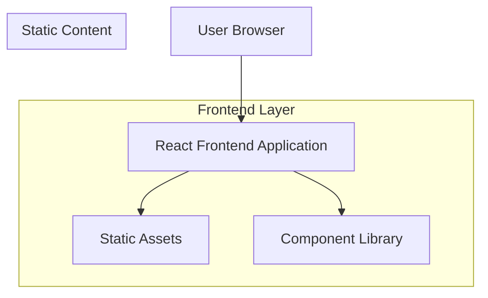

## 1. Architecture design



## 2. Technology Description
- Frontend: React@18 + tailwindcss@3 + vite
- Initialization Tool: vite-init
- Backend: None (static content page)
- Additional: Framer Motion for animations, React Icons for iconography

## 3. Route definitions
| Route | Purpose |
|-------|---------|
| /about | About Us page, displays company information and mission |
| / | Home page (existing) |

## 4. Component Hierarchy

### 4.1 Page Structure
```
AboutUsPage
├── Header (shared component)
├── AboutHeroSection
├── WhoWeAreSection
├── ApproachToCareSection
├── WhatMakesUsDifferentSection
├── WhyChooseSection
├── TestimonialsSection
├── CTASection
└── Footer (shared component)
```

### 4.2 Component Details

**AboutHeroSection**
- Props: title, subtitle, ctaText, backgroundImage
- Styling: Full-width container with teal/green gradient background
- Children: Heading, subheading, CTA button

**WhoWeAreSection**
- Props: heading, content, imageSrc, imageAlt
- Styling: White background with abstract shape overlay
- Layout: Text left, image right on desktop, stacked on mobile

**ApproachToCareSection**
- Props: heading, bulletPoints[]
- Styling: Light gray/green background
- Features: Rounded pill bullets with check icons

**WhatMakesUsDifferentSection**
- Props: heading, featureCards[]
- Styling: White background, 2x2 grid layout
- Cards: White with shadows, rounded corners

**WhyChooseSection**
- Props: heading, bulletPoints[], imageSrc
- Styling: Teal rounded panel left, image card right

**TestimonialsSection**
- Props: testimonials[]
- Features: Horizontal scroll/carousel
- Styling: White cards with gold stars

**CTASection**
- Props: heading, primaryButton, secondaryButton
- Styling: Light gray rounded panel, centered content

## 5. Asset Requirements

### 5.1 Images
- Hero background with overlapping photos
- Who we are section image (care/support imagery)
- Approach to care supporting images (2)
- Why choose section photo
- Testimonial headshots (if available)

### 5.2 Icons
- Heart/people logo mark
- Green check marks for bullets
- Gold stars for testimonials
- Navigation icons (if needed)

## 6. Styling System

### 6.1 Color Palette
```css
:root {
  --primary-teal: #2D7D7D;
  --primary-green: #4A9B9B;
  --accent-coral: #FF6B4A;
  --text-dark: #2D3748;
  --text-light: #FFFFFF;
  --background-light: #F7FAFC;
  --card-white: #FFFFFF;
}
```

### 6.2 Typography Scale
```css
--text-xs: 0.75rem;
--text-sm: 0.875rem;
--text-base: 1rem;
--text-lg: 1.125rem;
--text-xl: 1.25rem;
--text-2xl: 1.5rem;
--text-3xl: 1.875rem;
--text-4xl: 2.25rem;
```

### 6.3 Spacing System
```css
--space-1: 0.25rem;
--space-2: 0.5rem;
--space-4: 1rem;
--space-8: 2rem;
--space-16: 4rem;
--space-24: 6rem;
```

## 7. Performance Considerations
- Lazy load images below the fold
- Optimize images for web (WebP format, appropriate sizing)
- Implement smooth scrolling for navigation
- Use CSS transitions for hover effects
- Minimize JavaScript for better Core Web Vitals