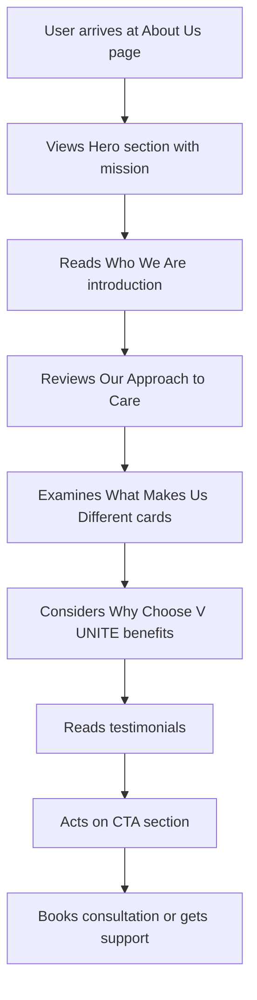

## 1. Product Overview
The About Us page for V UNITE disability support provider showcases the organization's mission, values, and team to build trust with NDIS participants and their families. The page emphasizes person-centered care approach and highlights what makes V UNITE different from other providers.

## 2. Core Features

### 2.1 User Roles
No user roles required - this is a public informational page accessible to all visitors.

### 2.2 Feature Module
Our About Us page requirements consist of the following main sections:
1. **Hero section**: Mission statement with gradient background and supporting imagery
2. **Who We Are section**: Company introduction with text and image
3. **Our Approach to Care section**: Service methodology with bullet points
4. **What Makes Us Different section**: Four feature cards highlighting key differentiators
5. **Why Choose V UNITE section**: Benefits list with visual emphasis
6. **Testimonials section**: Client feedback carousel
7. **CTA section**: Call-to-action with dual buttons

### 2.3 Page Details
| Page Name | Module Name | Feature description |
|-----------|-------------|---------------------|
| About Us | Hero section | Display mission statement "Supporting People, Not Just Plans" with teal/green gradient background, white text, and overlapping photos on right side. Include subheading about helping participants achieve outcomes and primary CTA button "GET SUPPORT". |
| About Us | Who We Are section | Present company introduction with teal heading, dark gray body text describing V UNITE as disability support provider with tailored services, experienced team offering respectful and culturally aware care. Include rounded image card on right side. |
| About Us | Our Approach to Care section | Showcase care methodology with teal/orange accent heading, bullet list in rounded pills with green check icons covering health assistance, activity participation, evidence-based interventions, PBSP, routine support, goal coaching, collaborative planning, and system navigation. |
| About Us | What Makes Us Different section | Display four white feature cards with shadows in 2x2 grid layout. Cards include: Experienced & Caring Team, Consistency You Can Trust, Safety & Quality First, Clear Communication. Each card has title and brief description in gray text. |
| About Us | Why Choose V UNITE section | Feature teal rounded panel on left with white heading and bullet list including nurse-led care, reliable staff, dignity focus, and complex care understanding. Include photo card on right side for visual balance. |
| About Us | Testimonials section | Present horizontal row of testimonial cards with 5 gold stars, participant quotes, and attribution. Maintain consistent styling with white cards and gray text. |
| About Us | CTA section | Display light gray rounded panel with centered heading about funded care quality, featuring two rounded buttons: coral/orange "BOOK A CALL" and teal "GET SUPPORT". |

## 3. Core Process
Users navigate to the About Us page to learn about V UNITE's services and approach. The page provides comprehensive information about the organization's mission, methodology, and differentiators to build trust and encourage consultation bookings.

## 4. User Interface Design

### 4.1 Design Style
- **Primary colors**: Teal/green gradients (#2D7D7D, #4A9B9B)
- **Secondary colors**: Coral/orange accent buttons (#FF6B4A), white cards
- **Typography**: Bold headings, medium-weight subheads, sans-serif body text
- **Button style**: Rounded corners, soft shadows, pill-style tags
- **Layout**: Full-width sections, centered content with generous spacing
- **Iconography**: Heart/people emblem, green check marks, gold stars

### 4.2 Page Design Overview
| Page Name | Module Name | UI Elements |
|-----------|-------------|-------------|
| About Us | Hero section | Teal/green gradient background, white bold heading 48px+, white body text 18px, overlapping photos right side, white text on teal button with rounded corners |
| About Us | Who We Are section | White background with faint abstract shape, left-aligned text with teal heading 32px, dark gray body text 16px, rounded image card right side |
| About Us | Our Approach to Care section | Light gray/green background, centered teal heading 32px, bullet pills with green check icons, rounded corners on all elements |
| About Us | What Makes Us Different section | White background, centered teal heading 32px, 2x2 grid of white cards with soft shadows, rounded corners, consistent spacing |
| About Us | Why Choose V UNITE section | Teal rounded panel (border-radius: 16px), white heading and text, photo card right side with matching rounded corners |
| About Us | Testimonials section | White background, teal heading 32px, horizontal scroll/carousel of white cards with gold stars and gray text |
| About Us | CTA section | Light gray rounded panel, centered dark gray heading 24px, two rounded buttons with consistent spacing |

### 4.3 Responsiveness
Desktop-first design approach with mobile adaptation. Sections stack vertically on mobile with adjusted font sizes and spacing. Touch-friendly button sizes and swipe gestures for testimonial carousel.