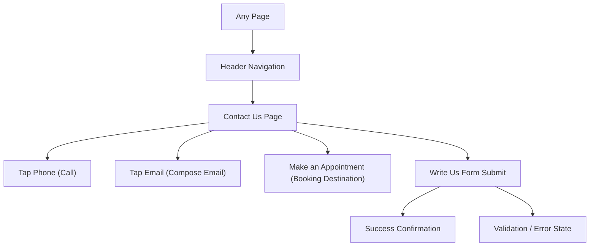

## 1. Product Overview
Add a Contact Us page that matches the existing VUnite site style and layout.
It helps visitors quickly contact the team via phone/email and send a message via a simple form, with a clear appointment CTA.

## 2. Core Features

### 2.1 Feature Module
Our requirements consist of the following main pages:
1. **Contact Us page**: reuse Header/Footer, hero with contact pills + appointment CTA, “Write Us” form, supporting image panel, submission confirmation.

### 2.2 Page Details
| Page Name | Module Name | Feature description |
|-----------|-------------|---------------------|
| Contact Us | Header (reused) | Show existing site navigation and primary CTA; highlight current page in nav. |
| Contact Us | Hero (Get in touch) | Present page heading (“Get in touch / Contact us”) and brief helper text. |
| Contact Us | Contact pills | Display phone and email as pill components; allow click-to-call and click-to-email actions. |
| Contact Us | Appointment CTA | Provide prominent “Make an Appointment” button; open configured booking URL (new tab) or navigate to existing booking flow. |
| Contact Us | Write Us form | Capture Name, Phone, Email, Message; validate required fields; submit message; show success/failure state. |
| Contact Us | Image panel | Show a supportive on-brand image aligned with form; maintain consistent spacing and rounded card style. |
| Contact Us | Footer (reused) | Show existing footer content (address/contacts/links/services) and legal links. |

## 3. Core Process
- Visitor opens Contact Us from the header navigation.
- Visitor chooses one of three actions:
  - Call the phone number (tap/click).
  - Email the support address (tap/click).
  - Click “Make an Appointment” to open the booking destination.
- Visitor can send a message by filling the Write Us form and submitting; the page confirms success or displays inline errors.

