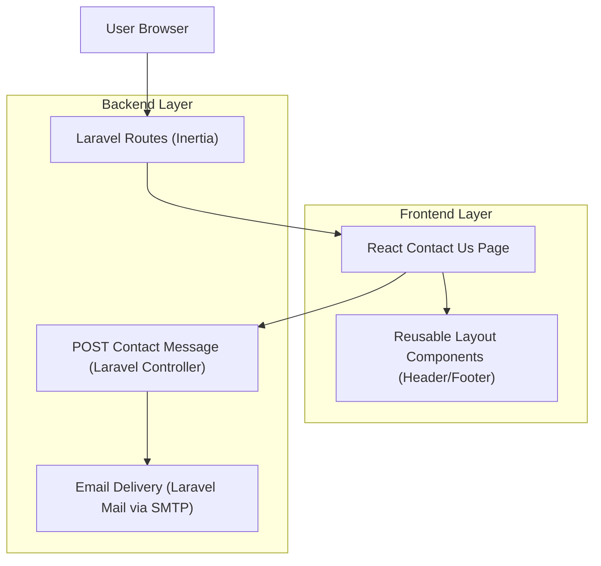
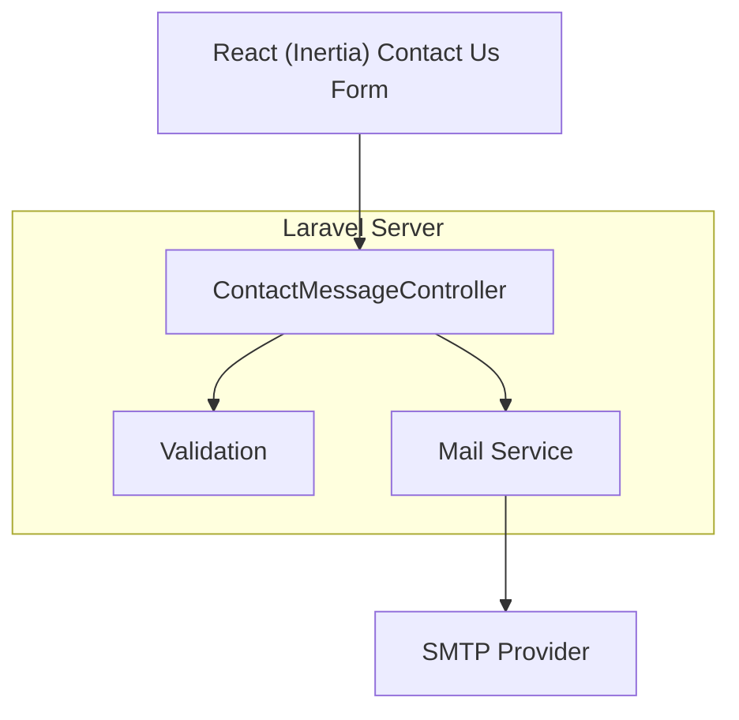

## 1.Architecture design


## 2.Technology Description
- Frontend: React (Inertia.js pages) + tailwindcss
- Backend: Laravel (routing, validation, mail dispatch)

## 3.Route definitions
| Route | Purpose |
|-------|---------|
| /contact-us | Contact Us page with hero, contact pills, appointment CTA, and Write Us form (Header/Footer reused) |
| /contact-us/message (POST) | Accept Write Us form submission, validate fields, and dispatch message via email (returns success/error) |

## 4.API definitions (If it includes backend services)
### 4.1 Core API
Submit contact form
```
POST /contact-us/message
```

Request:
| Param Name| Param Type | isRequired | Description |
|----------|------------|------------|-------------|
| name | string | true | Visitor name |
| phone | string | false | Visitor phone |
| email | string | true | Visitor email |
| message | string | true | Visitor message body |

Response:
| Param Name| Param Type | Description |
|----------|------------|-------------|
| ok | boolean | Whether submission succeeded |
| error | string \| null | Human-readable error message (if any) |

Shared TypeScript types (frontend usage)
```ts
type ContactMessageRequest = {
  name: string;
  phone?: string;
  email: string;
  message: string;
};

type ContactMessageResponse = {
  ok: boolean;
  error?: string;
};
```

## 5.Server architecture diagram (If it includes backend services)

