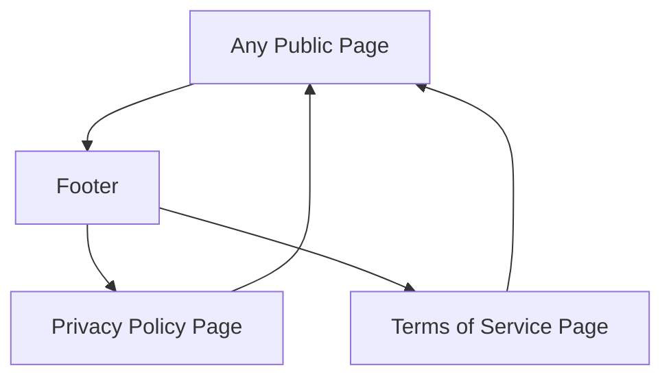

## 1. Product Overview
Add dedicated **Privacy Policy** and **Terms of Service** pages for V Unite Support Services, and link them from the site footer.
These pages provide clear legal/usage information to visitors and clients.

## 2. Core Features

### 2.1 Feature Module
Our legal requirements consist of the following main pages:
1. **Privacy Policy page**: policy content sections, last-updated info, contact point.
2. **Terms of Service page**: service terms content sections, last-updated info, contact point.

### 2.2 Page Details
| Page Name | Module Name | Feature description |
|-----------|-------------|---------------------|
| All pages (global) | Footer links | Display footer links to **Privacy Policy** and **Terms of Service**; open internal routes; remain visible and consistent across all public pages. |
| Privacy Policy page | Policy content | Present Tailwind-styled, readable policy sections relevant to V Unite Support Services: information collected, how it’s used, sharing, retention, security, cookies/analytics (if applicable), children’s privacy, changes, contact details. |
| Privacy Policy page | Page metadata | Set page title/description for SEO and sharing. |
| Terms of Service page | Terms content | Present Tailwind-styled, readable terms relevant to V Unite Support Services: scope of services, eligibility, user responsibilities, appointment/cancellation (if applicable), payments (if applicable), disclaimers/limitations, acceptable use, IP, termination, governing law, changes, contact details. |
| Terms of Service page | Page metadata | Set page title/description for SEO and sharing. |

## 3. Core Process
- Visitor scrolls to the footer on any page and selects **Privacy Policy** or **Terms of Service**.
- The site routes to the selected legal page and shows structured content with headings and an “Effective date / Last updated” line.
- Visitor can return via browser back or header navigation.

