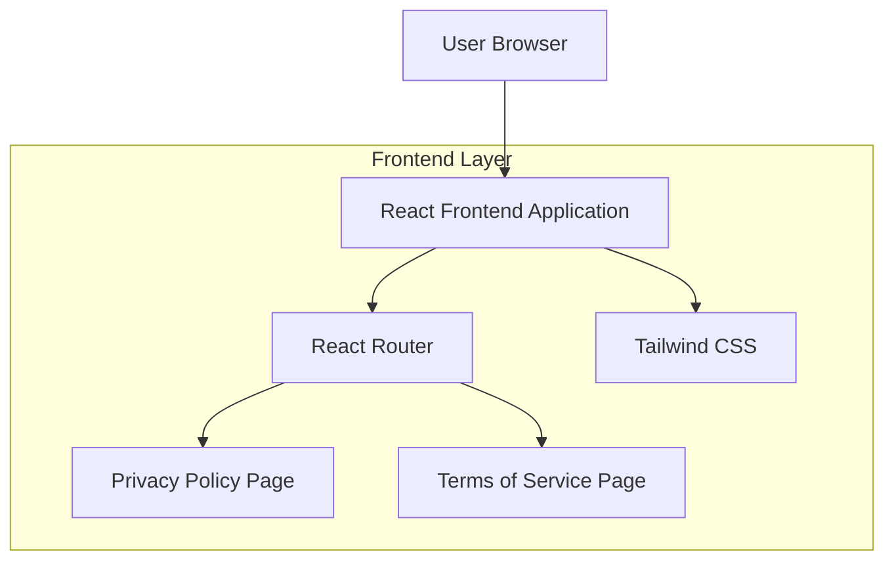

## 1.Architecture design

## 2.Technology Description
- Frontend: React@18 + react-router-dom@6 + tailwindcss@3 + vite
- Backend: None

## 3.Route definitions
| Route | Purpose |
|-------|---------|
| /privacy | Privacy Policy page (legal content and contact info) |
| /terms | Terms of Service page (service terms and contact info) |

## 4.API definitions (If it includes backend services)
Not applicable (no backend services).

## 6.Data model(if applicable)
Not applicable (no database required).
