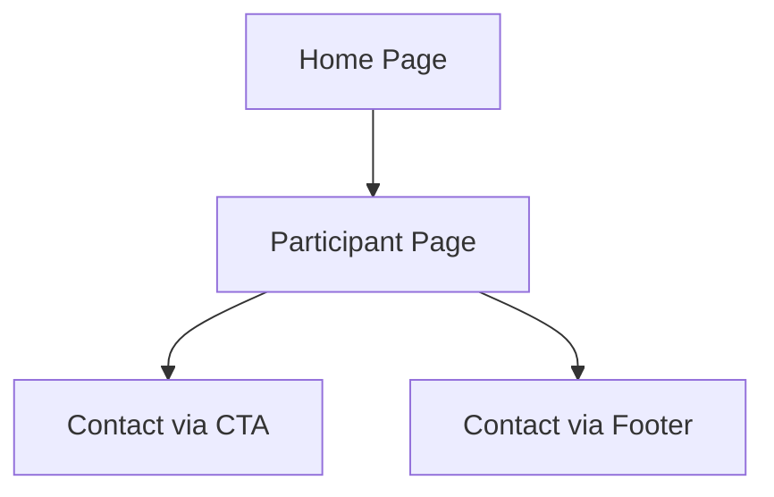

## 1. Product Overview
The Participant page is a dedicated information page for NDIS participants to understand their rights, safeguarding measures, and available support services. This page empowers participants with knowledge about their entitlements and V Unite's commitment to their safety and dignity.

## 2. Core Features

### 2.1 User Roles
No user roles required - this is a public information page accessible to all visitors.

### 2.2 Feature Module
The Participant page consists of the following main sections:
1. **Hero banner**: Reuses existing PageHero component with participant-focused messaging
2. **Your Rights section**: Four pill cards highlighting participant rights
3. **Safeguarding section**: Risk management systems with image collage
4. **CTA panel**: Reuses existing CTABanner component with care quality messaging
5. **Footer**: Standard site footer with contact information and services

### 2.3 Page Details
| Page Name | Module Name | Feature description |
|-----------|-------------|---------------------|
| Participant page | Hero banner | Display "Your Rights. Your Choice. Your Safety." heading with subtext about feeling safe and supported |
| Participant page | Your Rights section | Show four pill cards: Choices and control, Dignity and respect, Privacy and confidentiality, Safe ethical service delivery |
| Participant page | Safeguarding section | List incident management, complaints handling, staff training, NDIS compliance with three-image collage on right |
| Participant page | CTA panel | Display "You're already funded" message with CALL NOW and GET SUPPORT buttons |
| Participant page | Footer | Three-column layout with logo/contact, quick links, and services list |

## 3. Core Process
Users navigate to the Participant page from the main navigation. The page presents information about participant rights and safeguarding measures. Users can contact V Unite through the CTA buttons or footer contact information.

## 4. User Interface Design

### 4.1 Design Style
- Primary color: Dark teal (#0f6768)
- Secondary colors: Light teal backgrounds, coral/orange buttons
- Button style: Rounded pill buttons with subtle shadows
- Font: Clean sans-serif, headings bold, body regular
- Layout: Card-based with generous rounded corners
- Icon style: Minimalist teal/green icons

### 4.2 Page Design Overview
| Page Name | Module Name | UI Elements |
|-----------|-------------|-------------|
| Participant page | Hero banner | Full-width image with teal overlay, white left-aligned text, bold headings |
| Participant page | Your Rights section | Two-column layout: left image with floating logo, right text with four rounded pill cards |
| Participant page | Safeguarding section | Left text column with bullet list cards, right three-image grid with rounded corners |
| Participant page | CTA panel | Full-width pale teal rounded card with left prompt text and right action buttons |
| Participant page | Footer | Teal background, three columns, white text, bottom grey bar with legal links |

### 4.3 Responsiveness
Desktop-first design with mobile-adaptive layout. Hero text stacks on mobile, pill cards reflow vertically, two-column sections become single column, image collage stacks vertically.

### 4.4 3D Scene Guidance
Not applicable - this is a 2D informational page.