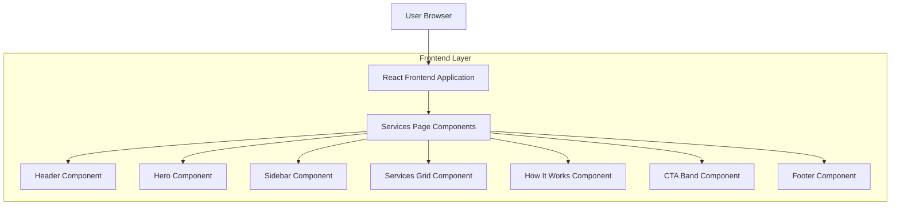

## 1. Architecture design

## 2. Technology Description
- Frontend: React@18 + tailwindcss@3 + vite
- Initialization Tool: vite-init
- Backend: None (static content page)

## 3. Route definitions
| Route | Purpose |
|-------|---------|
| /services | Services page displaying NDIS support services with hero, sidebar, services grid, How It Works section, and CTA band |

## 4. API definitions
Not applicable - this is a static content page with no backend integration required.

## 5. Server architecture diagram
Not applicable - no backend services required for this static content page.

## 6. Data model
Not applicable - no database required for static content display.