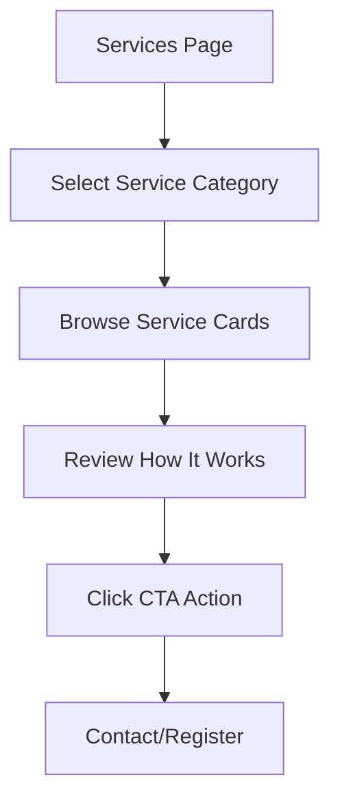

## 1. Product Overview
V Unite Services page showcases NDIS support services with an interactive layout featuring service categories, detailed service cards, and a clear process flow for potential clients seeking disability support services.

## 2. Core Features

### 2.1 User Roles
No user authentication required - this is a public information page for all visitors seeking NDIS support services.

### 2.2 Feature Module
Our Services page consists of the following main sections:
1. **Services page**: hero section with gradient background, service category sidebar, services grid with 9 cards, How It Works process section, and CTA band.

### 2.3 Page Details
| Page Name | Module Name | Feature description |
|-----------|-------------|---------------------|
| Services page | Header navigation | Display logo, menu items (Home, Services, Who We Help, About, Participate, Make Referral, FAQs), and "Register Your Interest" button |
| Services page | Hero section | Show gradient teal background with heading "Flexible NDIS Support, Built Around You" and supporting text about experienced team support |
| Services page | Service sidebar | Vertical list of 6 service categories with teal highlight for active selection, categories include: Core Supports, High Intensity & Community Nursing Care, Specialist Disability Accommodation (SDA), Behaviour Support, Specialist Support Coordination, Future Services |
| Services page | Services grid | 3x3 grid of service cards with rounded corners, each card contains title "Support Coordination", descriptive text about NDIS support, and "LEARN MORE >" button |
| Services page | How It Works | White card with 3-step process showing Contact Us, We Understand Your Needs, Start Your Support with circular icons and dashed arrows |
| Services page | CTA band | Two-column rounded teal card with compelling text about care quality and two action buttons: "CALL NOW" and "GET SUPPORT" |
| Services page | Footer | Teal gradient background with company info, quick links, services list, terms links, and copyright |

## 3. Core Process
Users navigate to the Services page to explore available NDIS support options. They can browse service categories via the sidebar, review detailed service offerings through the grid layout, understand the engagement process through the How It Works section, and take action via the CTA buttons to contact support or register interest.

## 4. User Interface Design

### 4.1 Design Style
- Primary colors: Teal/green gradient backgrounds
- Secondary colors: Coral/orange for action buttons, light gray for outlines
- Button style: Rounded pill shapes with solid coral and outline gray variants
- Font: Clean sans-serif with white text on gradients, dark gray body text
- Layout style: Card-based grid with generous white space and subtle shadows
- Icons: Simple line icons in soft green circular backgrounds

### 4.2 Page Design Overview
| Page Name | Module Name | UI Elements |
|-----------|-------------|-------------|
| Services page | Header | Teal/green heart-hands logo with globe, uppercase menu items in dark gray, coral "REGISTER YOUR INTEREST" pill button |
| Services page | Hero | Full-width teal gradient background, large white heading text, smaller white supporting text, right-side image of two people on sofa |
| Services page | Sidebar | Light gray vertical panel, service categories in gray text with teal background highlight for active item |
| Services page | Services grid | 3-column responsive grid, rounded light gray cards with subtle shadows, consistent card spacing |
| Services page | How It Works | Centered white card with shadow, three circular step icons with dashed connecting arrows |
| Services page | CTA band | Rounded light teal card, left column larger teal text, right column smaller gray text, two action buttons |
| Services page | Footer | Teal gradient background, three-column layout with white headings and text |

### 4.3 Responsiveness
Desktop-first design approach with mobile-adaptive layout. Service grid should stack to 2 columns on tablets and 1 column on mobile devices. Sidebar should convert to horizontal tabs or dropdown on smaller screens.

### 4.4 3D Scene Guidance
Not applicable - this is a 2D informational page design.