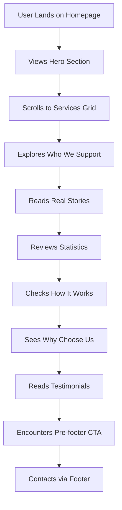

## 1. Product Overview
Redesign of V UNITE's homepage to match the provided reference design while maintaining accessibility standards and responsive behavior. The homepage serves as the primary entry point for NDIS participants, families, and support coordinators seeking disability support services.

## 2. Core Features

### 2.1 User Roles
No user authentication required for homepage - designed for public access to service information.

### 2.2 Feature Module
The homepage consists of the following main sections:
1. **Global Header**: Navigation bar with logo, menu items, and CTA button
2. **Hero Section**: Full-width banner with headline, bullet points, and primary CTA
3. **Services Grid**: 8 service cards displaying NDIS support categories
4. **Who We Support**: Three target audience blocks with icons
5. **Real Stories Section**: Image and text split layout with testimonials
6. **Statistics Grid**: Client retention stats and feature highlights
7. **How It Works**: Three-step process visualization
8. **Why Choose Us**: Benefits list with supporting image
9. **Testimonials Carousel**: Rotating client feedback cards
10. **Pre-footer CTA**: Secondary call-to-action banner
11. **Footer**: Three-column layout with contact info and links

### 2.3 Page Details
| Page Name | Module Name | Feature description |
|-----------|-------------|---------------------|
| Homepage | Global Header | Display V UNITE logo, navigation menu (Home, About Us, Services, Resources, Contact), and Get Started CTA button |
| Homepage | Hero Section | Show NDIS/V UNITE subheading, main headline "Supporting You to Live More Independently", bullet list with check icons, primary CTA button, and NDIS badge |
| Homepage | Services Grid | Present 8 service cards with images, titles (Daily Living Support, Help to Manage Daily Activities, Community Participation, Therapeutic Supports, Support Coordination, NDIS Support, Respite Support, Transport Assistance), descriptions, and Learn More buttons |
| Homepage | Who We Support | Three colored blocks for NDIS Participants (teal), Families & Carers (green), Support Coordinators (coral) with icons and descriptions |
| Homepage | Real Stories | Left-aligned image of caregiving, right text with "Real Stories, Real Support" heading, paragraph, and two action buttons |
| Homepage | Statistics Grid | Display "90% client retention" statistic and 6 feature tiles with icons and labels |
| Homepage | How It Works | Three-step process with Contact Us, Discuss Your Needs, Start Your Support steps and connecting dotted line |
| Homepage | Why Choose Us | Teal background card with white bullet points and check icons, paired with caregiver assistance image |
| Homepage | Testimonials | Carousel displaying 3 testimonial cards with star ratings, names, roles, and quotes |
| Homepage | Pre-footer CTA | Rounded banner with persuasive text and two CTA buttons (Contact Us, Learn More) |
| Homepage | Footer | Three columns with logo/contact info, quick links, services list, and copyright/legal links |

## 3. Core Process
Users land on homepage and can navigate through sections to understand V UNITE's NDIS services. The primary flow involves browsing services, reading testimonials, and contacting the organization through multiple CTA points.

## 4. User Interface Design

### 4.1 Design Style
- **Primary Colors**: Teal/Green (#2b8c85), Coral/Pink accents, Purple NDIS badge
- **Secondary Colors**: Light teal cards, white backgrounds, gray puzzle-piece motifs
- **Button Style**: Rounded pill shapes with soft shadows
- **Typography**: Clean sans-serif, mixed weights, uppercase for section labels
- **Layout**: Full-width sections with generous padding, card-based design
- **Icons**: Flat, line/filled style, consistent across all sections

### 4.2 Page Design Overview
| Page Name | Module Name | UI Elements |
|-----------|-------------|-------------|
| Homepage | Global Header | Teal/white bar, left-aligned V UNITE logo, center navigation (small caps, gray/teal text), right coral CTA button |
| Homepage | Hero Section | Full-width rounded banner, soft pink/peach photo overlay, white text on teal gradient, left-aligned content, purple NDIS badge |
| Homepage | Services Grid | Two rows of 4 rounded cards each, light teal backgrounds, small images, titles, descriptions, white Learn More chips |
| Homepage | Who We Support | Three rounded blocks (teal, green, coral) with icons and labels, consistent spacing |
| Homepage | Real Stories | 50/50 split layout, left caregiving image, right text with green accent heading |
| Homepage | Statistics Grid | White background with puzzle-piece motif, red statistic text, 6 rounded feature tiles |
| Homepage | How It Works | Centered title, dotted connector line, three circular steps with colored icons |
| Homepage | Why Choose Us | Left teal card with white bullets, right supporting image |
| Homepage | Testimonials | Centered uppercase heading, carousel with star ratings, three rotating cards |
| Homepage | Pre-footer CTA | Rounded light teal banner, persuasive text, two rounded buttons |
| Homepage | Footer | Three-column teal layout, white headings, consistent link styling |

### 4.3 Responsiveness
Desktop-first design with mobile adaptation. Touch interaction optimization for mobile devices with appropriately sized tap targets and swipe gestures for carousel components.