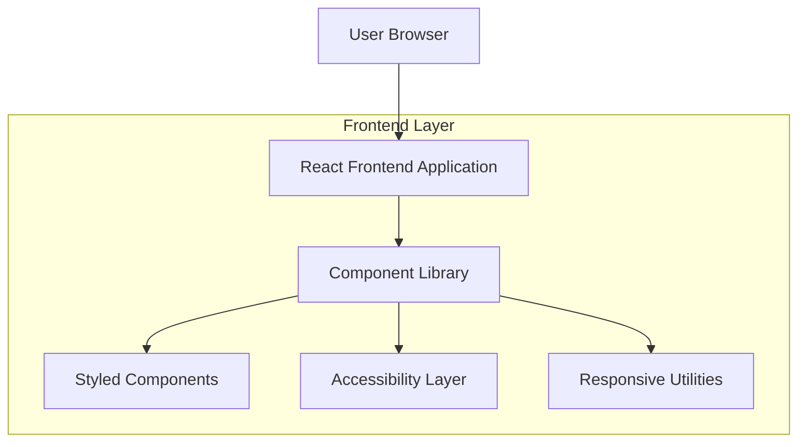

## 1. Architecture Design



## 2. Technology Description
- **Frontend**: React@18 + tailwindcss@3 + vite
- **Initialization Tool**: vite-init
- **Styling**: Tailwind CSS with custom color palette matching brand guidelines
- **Icons**: Lucide React for consistent iconography
- **Animation**: Framer Motion for smooth transitions and carousel functionality
- **Accessibility**: React Aria for ARIA compliance and keyboard navigation
- **Backend**: None (static content only)

## 3. Route Definitions
| Route | Purpose |
|-------|---------|
| / | Homepage - Main landing page with all sections |

## 4. Component Architecture

### 4.1 Core Components Structure
```typescript
// Main Layout Components
interface HeaderProps {
  logo: string;
  navigationItems: NavItem[];
  ctaButton: CTAButton;
}

interface HeroSectionProps {
  subheading: string;
  mainHeading: string;
  bulletPoints: string[];
  primaryCTA: CTAButton;
  secondaryBadge: Badge;
}

interface ServiceCardProps {
  title: string;
  description: string;
  image: string;
  learnMoreLink: string;
}

interface TestimonialCardProps {
  name: string;
  role: string;
  quote: string;
  rating: number;
}

interface StatisticsGridProps {
  mainStat: {
    percentage: number;
    text: string;
  };
  features: FeatureItem[];
}
```

### 4.2 Component Hierarchy
```
App
├── Header
│   ├── Logo
│   ├── Navigation
│   └── CTAButton
├── HeroSection
│   ├── BackgroundImage
│   ├── HeadingGroup
│   ├── BulletList
│   ├── PrimaryCTA
│   └── NDISBadge
├── ServicesGrid
│   └── ServiceCard (×8)
├── WhoWeSupport
│   └── SupportBlock (×3)
├── RealStories
│   ├── ImageSection
│   └── TextSection
├── StatisticsGrid
│   ├── MainStat
│   └── FeatureTiles
├── HowItWorks
│   ├── StepConnector
│   └── ProcessStep (×3)
├── WhyChooseUs
│   ├── BenefitsCard
│   └── SupportingImage
├── Testimonials
│   └── TestimonialCarousel
├── PreFooterCTA
│   ├── TextContent
│   └── ButtonGroup
└── Footer
    ├── LogoColumn
    ├── QuickLinks
    └── ServicesLinks
```

### 4.3 Responsive Breakpoints
- **Mobile**: 320px - 767px (Single column layout)
- **Tablet**: 768px - 1023px (Two column grid)
- **Desktop**: 1024px+ (Full multi-column layout)

### 4.4 Accessibility Requirements
- WCAG 2.1 AA compliance
- Keyboard navigation support
- Screen reader compatibility
- Focus management for interactive elements
- Color contrast ratios: 4.5:1 for normal text, 3:1 for large text
- Touch target minimum 44×44px for mobile

### 4.5 Performance Optimization
- Lazy loading for images below the fold
- Code splitting for non-critical components
- Optimized font loading with font-display: swap
- Image optimization with next-gen formats (WebP)
- Minified CSS and JavaScript bundles